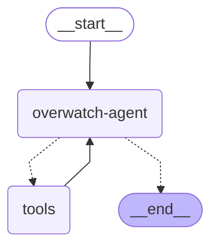

# Overwatch Local MCP Agent

This project demonstrates how to create an agent using LangGraph with Claude 3.5 Sonnet which connects to a Local MCP Server for UiPath instance control.

## Overview

The agent uses:
- Claude 3.5 Sonnet as the language model
- LangGraph for orchestration
- Connects to a Local MCP server for instance control operations

## Architecture



The workflow follows a ReAct pattern:
1. Query is sent to the agent (Claude)
2. Agent decides whether to use tools or provide a final answer
3. If tools are needed, the request is sent to the local MCP server
4. Results from tools are sent back to the agent
5. Process repeats until the agent has enough information to provide a final answer

## Prerequisites

- Python 3.10+
- `langchain-anthropic`
- `langchain-mcp-adapters`
- `langgraph`
- Anthropic API key set as an environment variable

## Installation

```bash
uv venv -p 3.11 .venv
.venv\Scripts\activate
uv sync
```

Create a `.env` file with your API keys and UiPath access token:

```bash
# Anthropic API Key for Claude 3.5 Sonnet
ANTHROPIC_API_KEY=your_anthropic_api_key

# UiPath Access Token (required for authentication)
UIPATH_ACCESS_TOKEN=your_uipath_access_token
```

## Usage

### Option 1: Using input.json with environment variable substitution

The `input.json` file contains placeholder values that reference environment variables. You can substitute them using:

```bash
# On Windows PowerShell
$content = Get-Content input.json -Raw
$content = $content -replace '\$\{UIPATH_ORG_ID\}', $env:UIPATH_ORG_ID
$content = $content -replace '\$\{UIPATH_TENANT\}', $env:UIPATH_TENANT
$content = $content -replace '\$\{UIPATH_ENVIRONMENT\}', $env:UIPATH_ENVIRONMENT
$content = $content -replace '\$\{FOLDER_KEY\}', $env:FOLDER_KEY
$content | uipath run overwatch-agent

# On Linux/Mac
envsubst < input.json | uipath run overwatch-agent
```

### Option 2: Direct command with environment variables

```bash
uipath run overwatch-agent "{\"messages\": [{\"role\": \"user\", \"content\": \"Call configure_server with these exact parameters: org_id=\\\"$UIPATH_ORG_ID\\\", tenant_name=\\\"$UIPATH_TENANT\\\", environment=\\\"$UIPATH_ENVIRONMENT\\\", folder_key=\\\"$FOLDER_KEY\\\". Then call debug_headers to verify that the MCP connection headers are being used correctly. Get the incident associated with instance ef828b4c-9141-48bf-be33-935c6be2b5e1. If the incident type is systematic, just retry the instance since most system type incidents are transient.\"}]}"
```

## Project Structure

```
OverwatchLocalMCP/
├── src/
│   └── overwatch-local-mcp/
│       ├── __init__.py
│       ├── graph.py              # Agent definition
│       └── instance_controller.py # MCP server with instance control tools
├── input.json                    # Sample input with environment variable placeholders
├── langgraph.json               # LangGraph configuration
├── pyproject.toml               # Project dependencies
└── README.md                    # This file
```

## MCP Tools Available

The local MCP server provides tools for:

- **Server Configuration**: Set org, tenant, environment, folder
- **Instance Management**: Resume, pause, retry, cancel instances
- **Variable Management**: Get and update instance variables
- **Incident Handling**: Retrieve and analyze incidents
- **Monitoring**: Get instance status and details

## Example Usage

The agent can handle natural language requests like:

- "Call configure_server with these exact parameters: org_id=\"${UIPATH_ORG_ID}\", tenant_name=\"${UIPATH_TENANT}\", environment=\"${UIPATH_ENVIRONMENT}\", folder_key=\"${FOLDER_KEY}\""
- "Get information about instance ef828b4c-9141-48bf-be33-935c6be2b5e1"
- "Resume instance ef828b4c-9141-48bf-be33-935c6be2b5e1 with comment 'Resuming via agent'"
- "Get the incident for instance ef828b4c-9141-48bf-be33-935c6be2b5e1 and retry if it's systematic" 