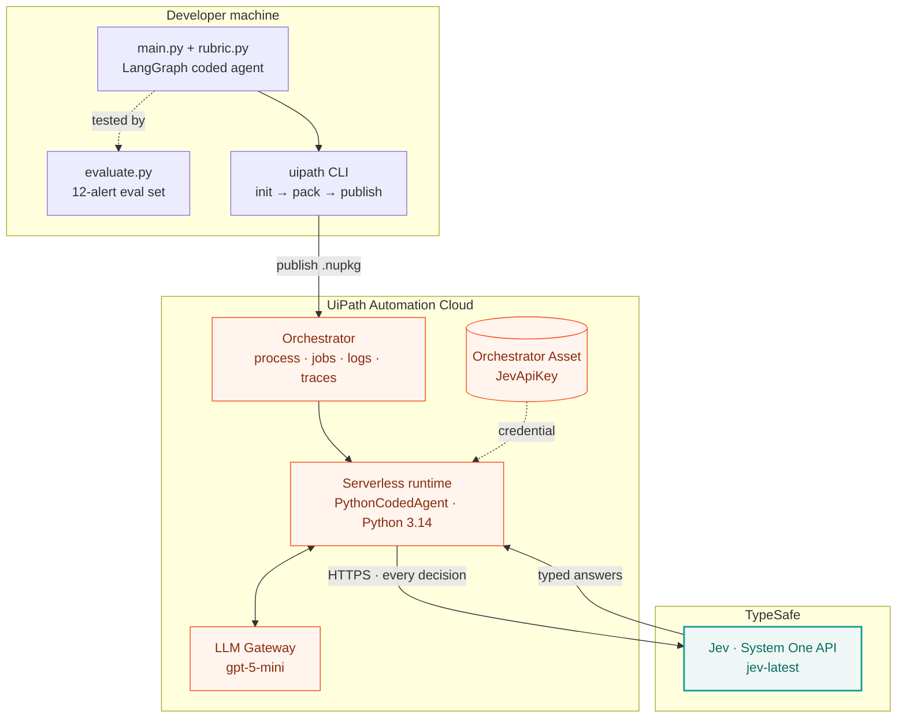
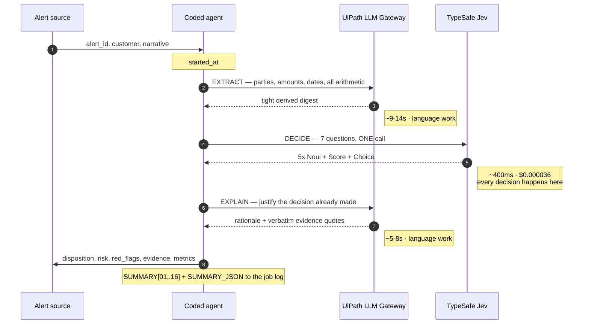
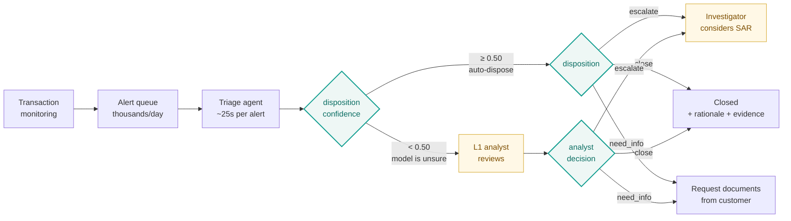

# Architecture & Flow

Three views of the same system: how it's **built and deployed**, what happens **during a
run**, and how it fits an **operational process**.

---

## 1. High-level architecture

Where the code lives, where it runs, and which calls leave the UiPath boundary.

**The one thing to notice:** only two things leave the container — the LLM Gateway call
(inside UiPath) and the Jev call (outside it). The Jev key never travels in the package; it
is read from an Orchestrator Asset at runtime, because `.env` does not reach serverless.

---

## 2. What happens during a run

The agent is three steps. The middle one is the whole point.

Why the split? **Jev cannot emit free text** — it returns only typed values. And the LLM is
poor value as a judge: on the eval set it matched Jev's accuracy exactly while taking 15.5×
longer per decision. So each model does what it is actually good at.

The arithmetic runs *before* Jev sees anything by design: Jev's own documentation lists
unreliable maths, date comparison and multi-step indirection as weaknesses. Asking it to
count would be asking it to fail.

---

## 3. How it fits an operations process

This is where the calibrated confidence earns its keep.

**Why the confidence gate is the real product.** On the eval set Jev's two wrong answers
came back at 0.31 and 0.75 confidence, while every correct answer sat between 0.89 and 1.00.
A gate at 0.50 routes one of the two misses to a human and touches **zero** correct
decisions. That is the difference between a model you can deploy and a demo.

An LLM asked the same question returns no usable confidence at all — which is the argument
for a calibrated decision model that has nothing to do with speed or cost.

---

## What this pattern is useful for

The AML use case is an example, not the point. The shape that fits is:

> **High volume · unstructured input · a written rubric · a small set of outcomes · an audit
> trail requirement.**

Anywhere that shape appears, the same three-step split applies — LLM reads, decision model
judges, LLM explains:

| Domain | Input | Rubric | Outcomes |
|---|---|---|---|
| **AML alert triage** *(built here)* | Alert narrative | FATF / Wolfsberg red flags | escalate · close · need_info |
| Insurance FNOL | Loss report, adjuster notes | Complexity + fraud indicators | fast-track · adjuster · SIU |
| KYC periodic refresh | Customer file changes | Risk-rating policy | no change · re-rate · EDD |
| Payment investigations | Failed payment + ops email | Failure taxonomy | repair · return · enquire |
| Complaint handling | Customer complaint text | Regulatory categories | category + severity + breach flag |
| Sanctions name screening | Name match candidates | Match-strength criteria | true match · false positive · review |
| Contract review | Clause text | Playbook of required terms | compliant · deviation · escalate |

**When this pattern does *not* fit:** if the answer must be free-form prose, or there is no
written rubric to judge against, or the volume is low enough that a human reads everything
anyway. Jev decides among defined options — it does not write, and it cannot invent the
policy it applies.

---

## The honest caveats

Carried here so they don't get lost in a demo:

- **Accuracy is a tie, not a win.** 10/12 for both Jev and the gateway LLM on the same
  seven-question task. At n=12 the comparison is not statistically meaningful in either
  direction. Jev's case is speed, cost and calibration.
- **The eval set is synthetic**, authored alongside the rubric. Real alerts are messier and
  the ground truth is contested — real analysts disagree with each other.
- **Cost units differ.** Jev bills in dollars; UiPath bills gateway calls in platform units.
  The comparison is reported in each model's own unit rather than converted with a guess.
