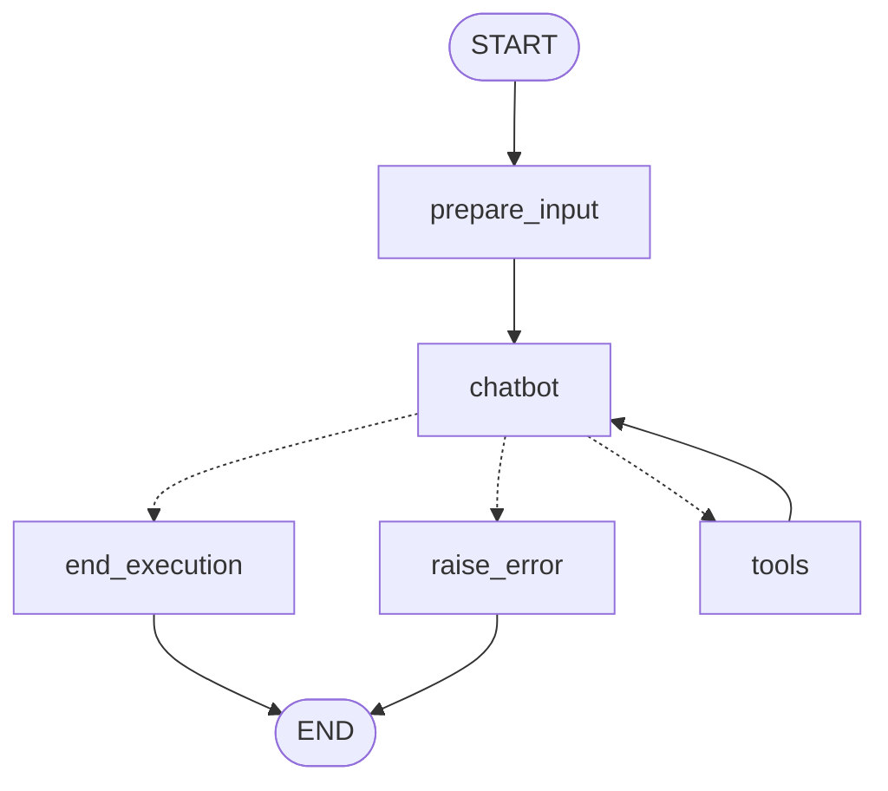

# UiPath LangGraph Gym Sample

A comprehensive sample demonstrating how to build **multiple LangGraph agents** with the UiPath platform. This project showcases proper input/output typing, dual-mode operation (CLI and batch evaluation), and integration with the UiPath evaluation system.

## Key Features

- **Multiple Agents**: Includes two complete agents (calculator and loan) with distinct capabilities
- **Dual-Mode Operation**: Each agent supports both CLI execution with typed inputs and batch evaluation
- **Type Safety**: Proper Pydantic models for inputs and outputs with runtime validation
- **Evaluation System**: Built-in comprehensive evaluation framework with multiple evaluator types
- **Export to UiPath Eval**: Export datapoints and evaluators to UiPath eval format via `export_evals.py`
- **Interactive Development**: Live testing with `uipath dev`
- **Tool Integration**: Mathematical tools, error handling, and structured output validation

## Agents Overview

This sample includes two agents demonstrating different use cases:

### 1. Calculator Agent
Performs mathematical calculations with proper order of operations.

**Input Schema** (`CalculatorInput`):
```json
{
  "expression": "15.0 + 7.0 * 3.0"
}
```

**Output Schema** (`CalculatorOutput`):
```json
{
  "answer": 36.0
}
```

**Tools**: `add`, `multiply`, `end_execution`, `raise_error`

### 2. Loan Agent
Processes loan requests from email bodies and can create Action Center tasks.

**Input Schema** (`LoanInput`):
```json
{
  "EmailBody": "I would like to request a loan for $50,000..."
}
```

**Output Schema** (`LoanOutput`):
```json
{
  "ExecutionDetails": "Processed loan request...",
  "ActionCenterTaskCreated": true,
  "ActionCenterTaskURL": "https://..."
}
```

**Tools**: Custom loan processing tools, Action Center integration

## Architecture

Both agents follow the ReAct pattern:



**Workflow:**
1. **prepare_input**: Converts typed input into state with system/user messages
2. **chatbot**: LLM interaction with tool calling capability (using UiPath LLM Gateway)
3. **conditional_routing**: Determines next action based on LLM response
4. **tools**: Executes agent-specific tools
5. **end_execution**: Returns properly typed output matching the output schema

## Prerequisites

- Python 3.10+
- UiPath account with LLM Gateway access
- `uv` for dependency management (recommended)

## Installation

```bash
# Install Python and create virtual environment
uv venv -p 3.11 .venv

# Activate the virtual environment (optional if using `uv run`)
# Linux/macOS: source .venv/bin/activate
# Windows: .venv\Scripts\activate

# Install dependencies (this properly installs gym_sample as a package)
uv sync
```

**Important**: After `uv sync`, the `gym_sample` package is properly installed and **no PYTHONPATH configuration is needed**. You can run Python modules directly, debug with F5 in VS Code, or use the convenience shell scripts.

### Updating Git Dependencies

This project uses a specific commit from the UiPath SDK that includes **tool call evaluators** (`ToolCallArgsEvaluator`, `ToolCallCountEvaluator`, `ToolCallOrderEvaluator`, `ToolCallOutputEvaluator`) and trajectory evaluators.

When setting up **for the first time**, `uv sync` automatically installs this version.

**Note:** We use a specific commit (not a branch) because later commits on the `mj/wire-tool` branch have configuration issues that prevent installation with `uv`. Once the upstream issue is resolved, this can be updated to track the branch directly.

## Authentication

Before running any agents, authenticate with UiPath:

```bash
uv run uipath auth
```

This opens a browser login and writes credentials to `.env`.

## Usage

### 1. CLI Mode - Single Execution with `uipath run`

Execute a single agent invocation with properly typed inputs:

```bash
# Direct command - Run calculator agent with inline JSON
uv run uipath run calculator '{"expression": "2 + 2"}'

# Direct command - Run loan agent
uv run uipath run loan '{"EmailBody": "I need a $50,000 loan for equipment"}'

# Using convenience script - Reads from test_input.json file
./run.sh calculator

# Using convenience script - With custom JSON input
./run.sh calculator '{"expression": "5 * 8"}'
./run.sh loan '{"EmailBody": "Need equipment loan"}'
```

**How it works:**
- The CLI validates JSON input against the agent's `input_schema` (e.g., `CalculatorInput`)
- The typed input is passed to the graph at runtime
- The `prepare_input` node converts it to state with system/human messages
- The agent executes and returns output matching the `output_schema`

**Using `run.sh` script:**
- Without a second argument: uses `src/gym_sample/{agent}/test_input.json`
- With a second argument: passes the JSON directly to the agent

### 2. Interactive Development Mode with `uipath dev`

For interactive development and testing:

```bash
uv run uipath dev
```

This provides:
- Live logs and traces
- Interactive chat interface
- Real-time debugging
- Agent selection prompt

### 3. Evaluation Modes

This sample supports **two types of evaluation**:

#### A. Python-Based Evaluation (Custom Evaluators)

Run comprehensive evaluations using Python-defined evaluators across all datapoints:

```bash
# Direct command - Run all calculator datapoints
python -m gym_sample.run --agent_name calculator --verbose

# Direct command - Run all loan datapoints
python -m gym_sample.run --agent_name loan --verbose

# Include LLM judge evaluators (if available)
python -m gym_sample.run --agent_name calculator --include_llm_judge
```

**How it works:**
- For each datapoint, a separate graph is built with input **pre-bound at build time**
- Each graph is invoked with an empty dict: `graph.ainvoke({})`
- Traces are collected using OpenTelemetry
- Custom Python evaluators run against the execution traces and outputs
- Results are aggregated and displayed

#### B. UiPath Platform Evaluation (via `uipath eval`)

Run evaluations using the UiPath platform's evaluation system:

```bash
# First, export Python evaluators and datapoints to UiPath eval format
./export_evals.sh

# Or with only supported evaluators
./export_evals.sh --only-supported

# Then run evaluation using UiPath CLI
./eval.sh calculator

# Evaluate loan agent
./eval.sh loan

# Or use direct command
uipath eval calculator evals/eval-sets/evaluation-set-calculator.json --output-file results/eval-results-calculator.json
```

**How it works:**
- Python-defined datapoints and evaluators are exported to JSON format
- The `uipath eval` CLI executes the agents with the evaluation framework
- Results are saved to `results/` directory
- Compatible with UiPath platform features and CI/CD pipelines

## Two Modes of Operation

This sample demonstrates a powerful pattern for supporting both CLI execution and batch evaluation:

### Mode 1: CLI Graph Builder

**Method**: `build_cli_graph()`

```python
graph = StateGraph(
    StateWithInput,
    input_schema=CalculatorInput,
    output_schema=CalculatorOutput
)
graph.add_node("prepare_input", self.prepare_input)
```

- Accepts input at runtime via `graph.ainvoke(CalculatorInput(...))`
- The `prepare_input` node receives typed input and converts to state
- Used by `uipath run` and `uipath dev` commands

### Mode 2: Evaluation Graph Builder

**Method**: `build_evaluation_graph(agent_input)`

```python
final_agent_input = self.scenario.input_schema.model_validate(agent_input)

graph = StateGraph(
    StateBaseClass,
    input_schema=CalculatorInput,
    output_schema=CalculatorOutput
)

# Lambda captures the pre-bound input
graph.add_node("prepare_input", lambda state=None: self.prepare_input(final_agent_input))
```

- Input is captured in a closure at graph build time
- Invoked with empty dict: `graph.ainvoke({})`
- Used by `run.py` for batch evaluation across multiple datapoints
- Each datapoint gets its own graph instance

**Why two separate builders?**
- CLI mode needs to accept input at `graph.ainvoke(input)` time
- Evaluation mode needs input pre-bound to avoid passing it multiple times
- Using closures instead of `partial` avoids signature conflicts with LangGraph

## Agent Evaluation System

### Overview

The evaluation system captures OpenTelemetry traces during agent execution and runs multiple evaluators to assess performance.

### Evaluator Types

Both agents include comprehensive evaluators:

#### ContainsEvaluator
- Checks if the output contains expected strings or values
- Returns boolean result (pass/fail)
- Used for validating specific content in responses

#### ExactMatchEvaluator
- Compares actual output with expected output
- Uses canonical JSON comparison with number normalization
- Returns boolean score

#### ToolCallOrderEvaluator
- Evaluates the sequence of tool calls made by the agent
- Extracts tool names from `ReadableSpan.attributes.tool_name`
- Returns numerical score (0.0 to 1.0) using Longest Common Subsequence (LCS)
- Example: For expression `15 + 7 * 3`, expects tool order `['multiply', 'add']`

#### LLM Judge Evaluators (optional)
- Use an LLM to evaluate response quality
- Can be enabled with `--include_llm_judge` flag

### Running Evaluations

**Python-based evaluations (custom evaluators):**

```bash
# Basic evaluation
python -m gym_sample.run --agent_name calculator

# Verbose output with detailed traces
python -m gym_sample.run --agent_name calculator --verbose

# Include LLM judge evaluators
python -m gym_sample.run --agent_name calculator --include_llm_judge

# Evaluate loan agent
python -m gym_sample.run --agent_name loan --verbose
```

**UiPath platform evaluations:**

```bash
# Export evaluators first (if not done already)
./export_evals.sh

# Run evaluation with UiPath CLI
./eval.sh calculator
./eval.sh loan
```

### Example Evaluation Output

```
Running evaluation for agent: calculator

Running datapoint 1/3: {'expression': '15.0 + 7.0 * 3.0'}
Agent completed. Result: {'answer': 36.0}
Collected 16 trace spans

--- Evaluating Datapoint 1/3 ---
Input: {'expression': '15.0 + 7.0 * 3.0'}
Output: {'answer': 36.0}

  Evaluating ExactMatchEvaluator with criteria: {'answer': 36.0}
  Result: score=1.0 evaluation_time=0.00004

  Evaluating ToolCallOrderEvaluator with criteria: ['multiply', 'add']
  Result: score=1.0 evaluation_time=0.00001
```

### Key Evaluation Files

- **`run.py`** - Main evaluation script and agent execution orchestrator
- **`trace_utils.py`** - OpenTelemetry trace collection utilities
- **`calculator/evals.py`** - Calculator-specific evaluators
- **`loan/evals.py`** - Loan-specific evaluators
- **`uipath_gym_types.py`** - Core types (`Datapoint`, `AgentBaseClass`, `BasicLoop`)

## Export to UiPath Eval Format

The `export_evals.py` script converts Python-defined datapoints and evaluators into the JSON format used by `uipath eval`:

### What Gets Exported

1. **Evaluator Specs** (version 1.0) → `evals/evaluators/`
   - Each evaluator is converted to a JSON file with configuration
   - Includes evaluator type ID and agent-specific settings

2. **Eval Sets** → `evals/eval-sets/`
   - Each agent's datapoints exported as evaluation sets
   - References the evaluator specs
   - Includes inputs, expected outputs, and evaluation criteria

### Running the Export

```bash
# Using convenience script - Export all evaluators and datapoints
./export_evals.sh

# Using convenience script - Export only supported evaluators
./export_evals.sh --only-supported

# Or use direct Python command
python -m gym_sample.export_evals
python -m gym_sample.export_evals --only-supported
```

### Output Structure

```
evals/
├── evaluators/
│   ├── evaluator-calculator_ContainsEvaluator.json
│   ├── evaluator-calculator_ExactMatchEvaluator.json
│   ├── evaluator-calculator_ToolCallOrderEvaluator.json
│   ├── evaluator-loan_ContainsEvaluator.json
│   └── ...
└── eval-sets/
    ├── evaluation-set-calculator.json
    └── evaluation-set-loan.json
```

### Using with `uipath eval`

Once exported, you can use the standard UiPath eval CLI:

```bash
# Using convenience script (recommended)
./eval.sh calculator
./eval.sh loan

# Or use direct command with full control
uipath eval calculator evals/eval-sets/evaluation-set-calculator.json --output-file results/eval-results-calculator.json

# The eval.sh script automatically:
# - Creates results/ directory
# - Cleans up previous state database for fresh runs
# - Saves results to results/eval-results-{agent}.json
```

**Benefits:**
- Define datapoints in Python with type safety
- Keep evaluators and test data in version control
- Export to standard format for CI/CD integration
- Share evaluation sets across teams
- Consistent evaluation process across local and CI/CD environments

## How It Works

### Input Handling Flow

**CLI Mode:**
1. User runs: `uipath run calculator '{"expression": "2 + 2"}'`
2. CLI validates JSON against `CalculatorInput` schema
3. Passes `CalculatorInput(expression="2 + 2")` to graph at runtime
4. `prepare_input` receives the `CalculatorInput`
5. Converts to `StateBaseClass` with system/human messages
6. Rest of graph executes normally

**Evaluation Mode:**
1. `build_evaluation_graph({"expression": "15.0 + 7.0 * 3.0"})` called
2. Input validated and captured in closure
3. Graph returned with input pre-bound
4. Later: `graph.ainvoke({})` - empty dict because input already bound
5. `prepare_input` closure executes, using captured input
6. Returns `StateBaseClass` with messages
7. Rest of graph executes normally

### Output Schema Handling

The `output_schema` is returned by wrapping the `end_execution` tool in a node function:

```python
def end_execution_node(state: StateBaseClass) -> BaseModel:
    """Wrapper node that calls end_execution tool and returns output_schema."""
    self.scenario.end_execution_tool.run(state)
    # Return the output_schema populated from state.result
    return self.scenario.output_schema.model_validate(state.result)

graph.add_node("end_execution", end_execution_node)
```

**Why this approach:**
- The `end_execution` tool validates the LLM's arguments against the schema
- Stores the validated data in `state.result`
- The wrapper node converts `state.result` to the proper `output_schema` type
- LangGraph recognizes this as the final output since it matches `output_schema=`

**Result:** When the graph completes, you get properly typed output like `{"answer": 36.0}` instead of just `{}`.

## Adding New Agents

To add a new agent with proper typing:

### 1. Define Input/Output Schemas

```python
# In src/gym_sample/myagent/agent.py
from pydantic import BaseModel, Field

class MyAgentInput(BaseModel):
    query: str = Field(description="The user's query")
    max_results: int = Field(default=5, description="Maximum number of results")

class MyAgentOutput(BaseModel):
    results: List[str] = Field(description="List of results")
    count: int = Field(description="Number of results returned")
```

### 2. Create Agent Configuration

```python
from langchain.tools import StructuredTool
from gym_sample.uipath_gym_types import AgentBaseClass, Datapoint
from gym_sample.tools import EndExecutionTool

def get_my_agent() -> AgentBaseClass:
    """Define the agent configuration."""
    return AgentBaseClass(
        system_prompt="You are a helpful research assistant...",
        user_prompt="Process this query: {query}\nMax results: {max_results}",
        input_schema=MyAgentInput,
        output_schema=MyAgentOutput,
        tools=[
            # Add your custom tools here
        ],
        datapoints=[
            Datapoint(
                name="basic_query",
                input={"query": "What is AI?", "max_results": 3},
                evaluation_criteria={
                    "ExactMatchEvaluator": {"count": 3},
                    "ContainsEvaluator": {"results": ["artificial", "intelligence"]}
                }
            )
        ]
    )
```

### 3. Create Entry Point

```python
# In src/gym_sample/graph.py
@asynccontextmanager
async def my_agent() -> StateGraph:
    """Pre-configured entry point for my_agent."""
    agent_scenario = get_agents()["my_agent"]
    loop = BasicLoop(scenario=agent_scenario, llm=get_model(), print_trace=True)
    return loop.build_cli_graph()

# Update get_agents() to include your agent
def get_agents() -> Dict[str, AgentBaseClass]:
    return {
        "calculator": get_calculator_agent(),
        "loan": get_loan_agent(),
        "my_agent": get_my_agent(),  # Add here
    }
```

### 4. Register in langgraph.json

```json
{
  "dependencies": ["."],
  "graphs": {
    "calculator": "./src/gym_sample/graph.py:calculator_agent",
    "loan": "./src/gym_sample/graph.py:loan_agent",
    "my_agent": "./src/gym_sample/graph.py:my_agent"
  },
  "env": ".env"
}
```

### 5. Use Your Agent

```bash
# CLI execution (direct)
uv run uipath run my_agent '{"query": "test", "max_results": 10}'

# CLI execution (with convenience script)
./run.sh my_agent '{"query": "test", "max_results": 10}'

# Python-based batch evaluation
python -m gym_sample.run --agent_name my_agent --verbose

# Export to UiPath eval format and run platform evaluation
./export_evals.sh
./eval.sh my_agent
```

## Convenience Shell Scripts

The project includes convenience scripts for common tasks:

### `run.sh` - Execute agents via CLI

```bash
# Run with test_input.json file
./run.sh calculator
./run.sh loan

# Run with custom JSON input
./run.sh calculator '{"expression": "2 + 2"}'
./run.sh loan '{"EmailBody": "Need a loan"}'
```

**What it does:**
- Without second argument: Uses `src/gym_sample/{agent}/test_input.json`
- With second argument: Passes JSON directly to `uipath run`

### `export_evals.sh` - Export evaluators

```bash
# Export all evaluators
./export_evals.sh

# Export only supported evaluators
./export_evals.sh --only-supported
```

**What it does:**
- Runs `python -m gym_sample.export_evals` to convert Python evaluators to JSON
- Creates files in `evals/evaluators/` and `evals/eval-sets/`

### `eval.sh` - Run UiPath platform evaluations

```bash
# Evaluate calculator agent
./eval.sh calculator

# Evaluate loan agent
./eval.sh loan

# Use custom eval set name
./eval.sh calculator custom-eval-set
```

**What it does:**
- Creates `results/` directory
- Cleans up previous state database (`__uipath/state.db`)
- Runs `uipath eval` with the specified agent and eval set
- Saves results to `results/eval-results-{eval-set-name}.json`

## Common Patterns

### Programmatic Usage

```python
# CLI mode - pass input at runtime
async with calculator_agent() as graph:
    compiled = graph.compile()
    result = await compiled.ainvoke(CalculatorInput(expression="2 + 2"))
    print(result)

# Evaluation mode - input pre-bound
async with agents_with_datapoints("calculator") as graphs:
    for graph, datapoint in graphs:
        compiled = graph.compile()
        result = await compiled.ainvoke({})  # Empty dict!
        print(f"Result for {datapoint.input}: {result}")
```

### Creating Custom Tools

```python
from langchain.tools import StructuredTool
from pydantic import BaseModel, Field

class DivideInput(BaseModel):
    a: float = Field(description="Dividend")
    b: float = Field(description="Divisor")

def divide(a: float, b: float) -> float:
    """Divide two numbers."""
    if b == 0:
        raise ValueError("Cannot divide by zero")
    return a / b

divide_tool = StructuredTool.from_function(
    func=divide,
    name="divide",
    description="Divide two numbers",
    args_schema=DivideInput
)

# Add to agent's tools list
agent = AgentBaseClass(
    # ...
    tools=[divide_tool],
)
```

## Project Structure

```
gym-sample/
├── src/
│   └── gym_sample/
│       ├── calculator/
│       │   ├── agent.py         # Calculator agent definition
│       │   ├── evals.py         # Calculator evaluators
│       │   └── test_input.json  # Sample test input
│       ├── loan/
│       │   ├── agent.py         # Loan agent definition
│       │   ├── evals.py         # Loan evaluators
│       │   ├── tools.py         # Loan-specific tools
│       │   └── test_input.json  # Sample test input
│       ├── graph.py             # Entry points and agent registry
│       ├── run.py               # Python-based evaluation runner
│       ├── export_evals.py      # Export to UiPath eval format
│       ├── trace_utils.py       # OpenTelemetry utilities
│       ├── tools.py             # Shared tools (end_execution, raise_error)
│       └── uipath_gym_types.py  # Core types (AgentBaseClass, BasicLoop, Datapoint)
├── evals/                       # Exported evaluation files (created by export_evals.sh)
│   ├── evaluators/              # Evaluator specs (version 1.0)
│   └── eval-sets/               # Evaluation sets
├── results/                     # Evaluation results (created by eval.sh)
├── run.sh                       # Convenience script for uipath run
├── eval.sh                      # Convenience script for uipath eval
├── export_evals.sh              # Convenience script for export
├── langgraph.json               # LangGraph configuration
├── uipath.json                  # UiPath project configuration
├── pyproject.toml               # Python dependencies & package config
└── README.md                    # This file
```

## Troubleshooting

**"ModuleNotFoundError: No module named 'gym_sample'"**
→ Run `uv sync` to properly install the package. After installation, no PYTHONPATH is needed.

**"got multiple values for argument"**
→ Using `partial` instead of closure in evaluation mode. Use a lambda closure in `build_evaluation_graph()`.

**"Field required" in CLI mode**
→ Check that `input_schema=` is set correctly in the StateGraph constructor.

**401 Unauthorized**
→ Run `uv run uipath auth` to authenticate with UiPath.

**Input not being used in evaluation**
→ In evaluation mode, make sure you're calling `ainvoke({})` with an empty dict, not passing input again.

**Tool not found**
→ Ensure the tool is added to the agent's `tools` list and properly bound with `llm.bind_tools()`.

**Export fails with missing evaluator**
→ Check that all evaluators referenced in `datapoint.evaluation_criteria` are returned by `get_evaluators()`.

**Evaluation criteria mismatch**
→ Ensure evaluator names in `datapoint.evaluation_criteria` match the `name` attribute of your evaluator classes.

**Shell scripts not executable**
→ Run `chmod +x run.sh eval.sh export_evals.sh` to make them executable.

## Additional Resources

- [UiPath Python SDK Documentation](https://uipath.github.io/uipath-python/)
- [UiPath LangGraph SDK Documentation](https://uipath.github.io/uipath-python/langchain/quick_start/)
- [LangGraph Documentation](https://langchain-ai.github.io/langgraph/)
- [AGENTS.md](./AGENTS.md) - Comprehensive guide for UiPath workflows & agentic solutions

## License

See the main repository for license information.
