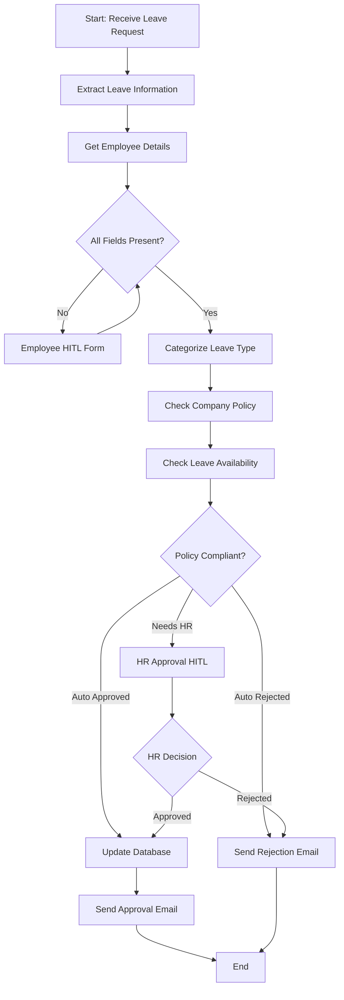

# Leave Management Agent

An intelligent, automated leave request processing system built with LangGraph and UiPath SDK that streamlines employee leave management through AI-powered decision making, policy compliance checks, and human-in-the-loop approvals.

## Workflow


## Demo Video
[](https://youtu.be/sGMS7WFrees?si=J0TDSdNuiu5cbdHx)


## Features

- **Intelligent Leave Request Parsing**: Automatically extracts leave dates, duration, and reasons from natural language requests
- **Smart Categorization**: AI-powered classification of leave types (Vacation, Sick Leave, Maternity/Paternity, Bereavement, Personal Leave)
- **Policy Compliance**: Real-time validation against company policies using UiPath Context Grounding
- **Leave Balance Management**: Integration with employee database via MCP (Model Context Protocol)
- **Human-in-the-Loop (HITL)**: Action Tasks (UiPath Action App) for missing information and HR approvals
- **Automated Email Notifications**: Sends approval/rejection emails with detailed information
- **Database Integration**: Automatic leave balance updates upon approval

## Architecture

The agent is built using a **state machine architecture** with LangGraph, enabling complex workflows with conditional branching and human intervention points.

### Key Components

1. **LangGraph State Machine**: Orchestrates the entire workflow
2. **UiPath Services Integration**:
   - **Context Grounding**: Policy document retrieval and compliance checking
   - **MCP Server**: Database operations (employee details, leave balance)
   - **HITL Actions**: Action Tasks (UiPath Action App) for user input and approvals
3. **LLM (GPT-4)**: Natural language understanding and decision making
4. **Email Service**: Automated notifications via MCP


## Getting Started

### Prerequisites

- Python 3.10+
- UiPath Automation Suite account
- LLM API key
- MCP Server configured with database access

### Installation

1. **Clone the repository**
   ```bash
   git clone https://github.com/rajneeshk94/LeaveManagementAgent.git
   cd LeaveManagementAgent
   ```

2. **Install dependencies**
   ```bash
   pip install -r requirements.txt
   ```

3. **Configure environment variables**
   
   Create a `.env` file:
   ```env
   # MCP Server
   MCP_SERVER_URL=https://your-mcp-server-url
   
   # Optional: If not using UiPath's LLM
   OPENAI_API_KEY=your_openai_key
   ```

4. **Set up UiPath Resources**
   
   - **Context Grounding Index**: Create an index named `company-policy-index` with your HR policies
   - **MCP Server Tools**: Configure the following tools:
     - `getemployeedetails`: Retrieve employee information
     - `getleavebalance`: Fetch leave balance
     - `updateleavebalance`: Update leave records
     - sendemail`: Email notification service
   - **HITL Apps**: Deploy the following apps in your `Shared` folder:
     - `LeaveRequestApp`: Employee information app
     - `HRApprovalApp`: HR approval app

5. **Authenticate with UiPath**
    ```bash
    uipath auth
   ```

6. **Package the project**
    ```bash
    uipath pack
   ```

7. **Publish the project**
    ```bash
    uipath publish

   - When prompted, select tenant to upload
   ```

### Running the Agent

```python
import asyncio
from main import agent, GraphState

async def process_leave_request():
    # Initialize state with employee's leave request
    initial_state = GraphState(
        leave_request="I need leave from Dec 20 to Dec 25 for vacation",
        employee_email="john.doe@company.com"
    )
    
    # Run the agent
    final_state = None
    async for event in agent.astream(initial_state):
        print(f"Event: {event}")
        final_state = event
    
    # Check final status
    if final_state:
        print(f"\nFinal Status: {final_state['final_status']}")

# Run the async function
if __name__ == "__main__":
    asyncio.run(process_leave_request())
```

## Configuration

### Leave Categories

The system supports five leave types:
- **Vacation**: Personal time off, travel, recreation
- **Sick Leave**: Illness, medical appointments, mental health
- **Maternity/Paternity**: Pregnancy, childbirth, adoption
- **Bereavement**: Death of family member, funeral attendance
- **Personal Leave**: Personal matters not covered elsewhere

### Default Leave Balances

```python
{
    "Vacation": 20,
    "Sick Leave": 12,
    "Maternity/Paternity": 90,
    "Bereavement": 5,
    "Personal Leave": 3
}
```

### HR Approval Triggers

HR approval is required when:
- Leave duration exceeds 5 days
- Leave type is Maternity/Paternity
- Policy violations detected
- Insufficient leave balance
- Policy explicitly requires HR review

## MCP Server Setup

Your MCP server should implement these endpoints:

**GET `/getemployeedetails`**
```json
{
  "employee_email": "user@company.com"
}
```

**GET `/getleavebalance`**
```json
{
  "employee_email": "user@company.com"
}
```

**POST `/updateleavebalance`**
```json
{
  "employee_email": "user@company.com",
  "leave_type": "Vacation",
  "days": 5
}
```

**POST `/sendemail`**
```json
{
  "Recipient": "user@company.com",
  "Subject": "Leave Request Status",
  "Body": "<html>...</html>"
}
```

## Project Structure

```
leave-management-agent/
├── main.py                 # Main agent code
├── requirements.txt        # Python dependencies
├── .env                    # Environment variables (not committed)
├── README.md              # This file
├── Images/
│   ├── agent.png
```

## Customization

### Adding New Leave Types

1. Update the `categorize_node` system prompt
2. Add default balance in `default_leave_balance()`
3. Update company policies in Context Grounding index

### Modifying Approval Rules

Edit the `check_policy_node` function to adjust:
- HR approval thresholds
- Policy validation logic
- Balance checking rules

### Email Templates

Customize email content in:
- `send_approval_email_node`
- `send_rejection_email_node`

