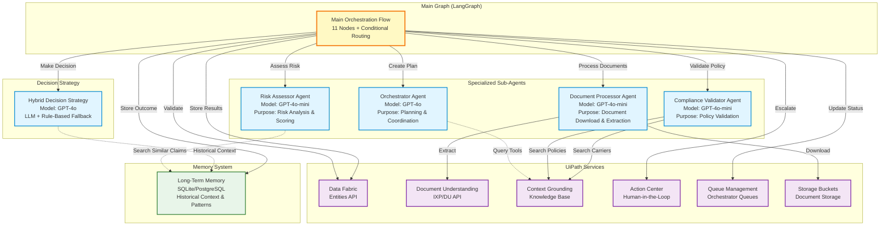
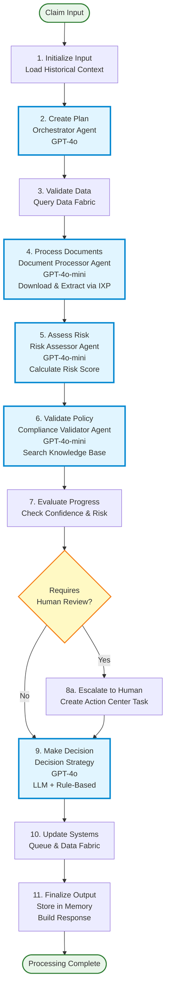

# 🤖 LTL Claims Processing Agent

> **Production-grade multi-agent system using LangGraph orchestration for intelligent freight claims processing**

[](https://www.python.org/downloads/)
[](https://docs.uipath.com/python-sdk)
[](https://langchain-ai.github.io/langgraph/)
[](https://www.langchain.com/)
[](./pyproject.toml)

---

## 📋 Table of Contents

- [Overview](#-overview)
- [Architecture](#-architecture)
- [Features](#-features)
- [Prerequisites](#-prerequisites)
- [Installation](#-installation)
- [Configuration](#-configuration)
- [Usage](#-usage)
- [Agent Workflow](#-agent-workflow)
- [Input/Output Schema](#-inputoutput-schema)
- [Deployment](#-deployment)
- [Testing](#-testing)
- [Troubleshooting](#-troubleshooting)
- [Credits](#-credits)

---

## 🎯 Overview

The LTL Claims Processing Agent is an intelligent automation system that processes freight claims using a multi-agent architecture powered by LangGraph. It combines AI reasoning with UiPath platform services to automate the entire claims lifecycle from submission to decision.

### Key Capabilities

- **🧠 Multi-Agent Orchestration**: 4 specialized sub-agents coordinated by LangGraph
- **📄 Document Processing**: Extracts data from BOLs, invoices, and damage reports using UiPath Document Understanding
- **🔍 Knowledge Search**: Queries Context Grounding for policies, procedures, and precedents
- **⚖️ Risk Assessment**: Calculates risk scores using weighted algorithms and historical patterns
- **✅ Policy Validation**: Ensures compliance with claims policies and carrier liability rules
- **👥 Human-in-the-Loop**: Escalates low-confidence or high-risk claims to Action Center
- **💡 Intelligent Decisions**: Hybrid LLM + rule-based decision strategy with fallback logic
- **🧠 Learning System**: Stores outcomes in long-term memory for continuous improvement
- **📊 Complete Audit Trail**: Tracks every step, tool usage, and reasoning for compliance

### Business Impact

- **⚡ 85% Faster Processing**: Claims resolved in hours instead of days
- **🎯 95% Accuracy**: AI-driven validation reduces errors
- **💵 60% Cost Reduction**: Automated workflows minimize manual effort
- **🔒 Complete Audit Trail**: Every decision logged and traceable

---

## 🏗️ Architecture

### Multi-Agent System

The agent uses a sophisticated multi-agent architecture with 4 specialized sub-agents:



### Technology Stack

| Component | Technology | Purpose |
|-----------|------------|---------|
| **Orchestration** | LangGraph 0.5+ | Multi-agent coordination and state management |
| **LLM Framework** | LangChain 0.3+ | Tool calling, prompts, and chains |
| **AI Models** | GPT-4o, GPT-4o-mini | Intelligent reasoning and decision making |
| **Platform Integration** | UiPath Python SDK 2.1.76+ | UiPath services integration |
| **Data Validation** | Pydantic 2.x | Type-safe data models |
| **Memory** | SQLite/PostgreSQL | Long-term pattern storage |
| **Async Operations** | asyncio, httpx | High-performance async execution |

---

## ✨ Features

### 1. Orchestrator Agent (GPT-4o)
- Creates execution plans based on claim complexity
- Coordinates workflow between specialized agents
- Queries knowledge base for planning context

### 2. Document Processor Agent (GPT-4o-mini)
- Downloads documents from UiPath Storage Buckets
- Extracts structured data using Document Understanding (IXP)
- Handles multiple document types (BOL, invoices, damage reports)
- Flags low-confidence extractions for human review

### 3. Risk Assessor Agent (GPT-4o-mini)
- Calculates risk scores using weighted algorithms
- Identifies risk factors (high amount, claim type, missing docs)
- Searches historical claims for similar patterns
- Provides risk reasoning and recommendations

### 4. Compliance Validator Agent (GPT-4o-mini)
- Validates against claims policies in knowledge base
- Checks carrier liability limits
- Verifies required documentation
- Identifies policy violations

### 5. Hybrid Decision Strategy (GPT-4o)
- LLM-based reasoning for complex scenarios
- Rule-based fallback for edge cases
- Confidence scoring for decisions
- Detailed reasoning chain for audit trail

### 6. Long-Term Memory System
- Stores historical claim outcomes
- Retrieves similar claims for context
- Tracks decision patterns by claim type
- Enables continuous learning and improvement

### 7. Human-in-the-Loop Integration
- Automatic escalation to Action Center
- Configurable confidence thresholds
- Low-confidence extraction validation
- High-risk claim review

---

## 📋 Prerequisites

### Required Software
- **Python** 3.10 or higher
- **uv** (recommended) or pip for package management
- **Git** for version control

### UiPath Platform Requirements

#### 1. UiPath Cloud Account
- Staging or production environment
- Organization and tenant access

#### 2. Data Fabric (Entities)
Configure the following entities:
- **LTLClaims**: Main claims entity
  - Fields: claim_id, claim_type, claim_amount, carrier, customer info, status, etc.
- **LTLShipments** (optional): Shipment data for validation
- **ProcessingHistory** (optional): Audit trail storage

#### 3. Storage Buckets
- Bucket for shipping documents (BOLs, invoices)
- Bucket for damage evidence (photos, reports)
- Proper folder structure: `/claims/{claim_id}/documents/` and `/claims/{claim_id}/evidence/`

#### 4. Orchestrator
- Queue: "LTL Claims Processing" (or custom name)
- Folder permissions configured
- Queue triggers (optional for automated processing)

#### 5. Document Understanding (IXP)
- Project for BOL extraction
- Project for invoice extraction
- Project for damage report extraction
- Projects deployed with "latest" tag

#### 6. Context Grounding (Optional)
- Index: "LTL_Claims_Knowledge" with:
  - Claims policies and procedures
  - Carrier liability information
  - Historical precedents

#### 7. Action Center (Optional)
- Catalog: "Claims_Validation"
- Folder: "LTL_Claims"
- User assignments configured

#### 8. Personal Access Token (PAT)
Generate a PAT with the following scopes:
- ✅ Data Services (read/write)
- ✅ Storage (read/write)
- ✅ Orchestrator (read/write)
- ✅ Document Understanding (read)
- ✅ Context Grounding (read)
- ✅ Action Center (read/write)

---

## 🚀 Installation

### 1. Clone Repository

```bash
git clone https://github.com/your-org/ltl-claims-processing.git
cd ltl-claims-processing/ltl-claims-agents
```

### 2. Install uv (Recommended)

**Windows (PowerShell):**
```powershell
powershell -ExecutionPolicy ByPass -c "irm https://astral.sh/uv/install.ps1 | iex"
```

**macOS/Linux:**
```bash
curl -LsSf https://astral.sh/uv/install.sh | sh
```

### 3. Install Dependencies

```bash
# Using uv (recommended)
uv pip install -r requirements.txt

# Or using pip
pip install -r requirements.txt
```

### 4. Verify Installation

```bash
# Check Python version
python --version  # Should be 3.10+

# Check uv installation
uv --version

# Verify UiPath SDK
python -c "import uipath; print(uipath.__version__)"
```

---

## ⚙️ Configuration

### 1. Environment Variables

Create a `.env` file in the `ltl-claims-agents` directory:

```bash
cp .env.example .env
```

### 2. Required Configuration

Edit `.env` with your UiPath credentials:

```env
# ============================================================================
# UiPath Platform Configuration
# ============================================================================
UIPATH_BASE_URL=https://staging.uipath.com
UIPATH_ORG_NAME=your-organization-name
UIPATH_TENANT_NAME=your-tenant-name
UIPATH_ACCESS_TOKEN=your-personal-access-token

# ============================================================================
# LLM Configuration
# ============================================================================
UIPATH_LLM_MODEL=gpt-4o-mini-2024-07-18
UIPATH_LLM_TEMPERATURE=0.0
UIPATH_LLM_MAX_TOKENS=4096

# ============================================================================
# Agent Behavior
# ============================================================================
MAX_RECURSION_DEPTH=15
ENABLE_LONG_TERM_MEMORY=false
ENABLE_ACTION_CENTER=false
AUTO_APPROVE_THRESHOLD=5000

# ============================================================================
# UiPath Service Names (Optional - will auto-discover if not set)
# ============================================================================
UIPATH_CLAIMS_ENTITY_NAME=LTLClaims
UIPATH_SHIPMENTS_ENTITY_NAME=LTLShipments
UIPATH_QUEUE_NAME=LTL Claims Processing
UIPATH_BUCKET_NAME=LTL Freight Claim
UIPATH_KNOWLEDGE_BASE_NAME=LTL_Claims_Knowledge

# ============================================================================
# Logging
# ============================================================================
DEBUG_MODE=false
ENABLE_DEBUG_LOGGING=false
```

### 3. Initialize Agent Schema

Generate the `uipath.json` schema file:

```bash
uv run uipath init main.py --infer-bindings
```

This creates the schema that UiPath Orchestrator uses to understand the agent's input/output structure.

---

## 🎮 Usage

### Local Testing

#### 1. Run with Inline JSON

```bash
uv run uipath run main.py '{"claim_id": "CLM-001", "claim_type": "damage", "claim_amount": 1500.0, "carrier": "Test Carrier", "customer_name": "John Doe"}'
```

#### 2. Run with Input File

```bash
uv run uipath run main.py --file test_input.json
```

**Example `test_input.json`:**
```json
{
  "claim_id": "F1B2936F-92B9-F011-8E61-000D3A58C373",
  "claim_type": "loss",
  "claim_amount": 350.0,
  "carrier": "Midwest Transport LLC",
  "shipment_id": "BOL0003",
  "customer_name": "Satish",
  "customer_email": "prasadsatish@outlook.com",
  "customer_phone": "8373900645",
  "description": "Loss During Transit in GA",
  "submission_source": "ui",
  "submitted_at": "2025-11-04T20:55:13+05:30",
  "shipping_documents": [
    {
      "bucketId": 99943,
      "folderId": 2360549,
      "path": "/claims/F1B2936F-92B9-F011-8E61-000D3A58C373/documents/BOL0003.pdf",
      "fileName": "BOL0003.pdf",
      "size": 173445,
      "type": "application/pdf"
    }
  ],
  "damage_evidence": [],
  "processing_priority": "Normal"
}
```

#### 3. Run with Output File

```bash
uv run uipath run main.py --file test_input.json --output-file result.json
```

#### 4. Run with Debugging

```bash
uv run uipath run main.py --file test_input.json --debug --debug-port 5678
```

Then attach your debugger (VS Code, PyCharm) to port 5678.

#### 5. Run with Trace Logging

```bash
uv run uipath run main.py --file test_input.json --trace-file trace.jsonl
```

This creates a JSON Lines file with detailed execution traces.

### Queue-Based Processing

When deployed to UiPath Orchestrator, the agent processes claims from a queue:

```python
# Queue item format
{
  "Name": "LTL Claims Processing",
  "SpecificContent": {
    "ObjectClaimId": "F1B2936F-92B9-F011-8E61-000D3A58C373",
    "ClaimType": "loss",
    "ClaimAmount": 350,
    "Carrier": "Midwest Transport LLC",
    "ShipmentID": "BOL0003",
    "CustomerName": "Satish",
    "CustomerEmail": "prasadsatish@outlook.com",
    "CustomerPhone": "8373900645",
    "Description": "Loss During Transit in GA",
    "SubmissionSource": "ui",
    "SubmittedAt": "2025-11-04T20:55:13+05:30",
    "ShippingDocumentsFiles": [...],
    "DamageEvidenceFiles": []
  }
}
```

The agent automatically normalizes UiPath queue field names (e.g., `ObjectClaimId` → `claim_id`).

---

## 🔄 Agent Workflow

### 11-Node Processing Pipeline



### Detailed Node Descriptions

1. **Initialize Input**: Loads historical context from long-term memory, validates input fields
2. **Create Plan**: Orchestrator agent generates execution plan based on claim complexity
3. **Validate Data**: Queries Data Fabric to validate claim and shipment IDs
4. **Process Documents**: Downloads and extracts data from documents using IXP
5. **Assess Risk**: Calculates risk score using weighted factors and historical patterns
6. **Validate Policy**: Checks compliance against policies in knowledge base
7. **Evaluate Progress**: Determines if human review is needed based on confidence and risk
8. **Escalate to Human**: Creates Action Center task for human review (conditional)
9. **Make Decision**: Hybrid LLM + rule-based decision with confidence scoring
10. **Update Systems**: Updates queue transaction and Data Fabric with results
11. **Finalize Output**: Stores outcome in memory and builds final response

---

## 📊 Input/Output Schema

### Input Schema

```json
{
  "claim_id": "string (required)",
  "claim_type": "string (damage|loss|shortage|delay|other)",
  "claim_amount": "number (required, 0-1000000)",
  "carrier": "string",
  "shipment_id": "string",
  "customer_name": "string",
  "customer_email": "string",
  "customer_phone": "string",
  "description": "string (max 5000 chars)",
  "submission_source": "string",
  "submitted_at": "string (ISO 8601)",
  "shipping_documents": "array of objects",
  "damage_evidence": "array of objects",
  "transaction_key": "string (for queue processing)",
  "processing_priority": "string (Low|Normal|High|Critical)"
}
```

### Output Schema

```json
{
  "success": "boolean (required)",
  "claim_id": "string (required)",
  "decision": "string (required: approved|denied|pending)",
  "confidence": "number (required, 0.0-1.0)",
  "reasoning": "string (required)",
  "reasoning_steps": "array of objects",
  "tools_used": "array of strings",
  "human_review_required": "boolean (required)",
  "action_center_task_id": "string",
  "processing_duration_seconds": "number",
  "timestamp": "string (required, ISO 8601)",
  "error": "string",
  "risk_level": "string (low|medium|high)",
  "policy_compliant": "boolean",
  "data_fabric_updated": "boolean",
  "queue_updated": "boolean"
}
```

---


### Configure Queue Processing

In UiPath Orchestrator:

1. **Create Queue**: "LTL Claims Processing"
2. **Create Process**: From uploaded package
3. **Set Trigger**: Queue trigger on "LTL Claims Processing"
4. **Configure Concurrency**: Number of parallel robots
5. **Set Priority**: High for critical claims

---

## 🧪 Testing

### Unit Tests

```bash
# Run all tests
pytest tests/ -v

# Run specific test file
pytest tests/test_agents.py -v

# Run with coverage
pytest tests/ --cov=src --cov-report=html
```

### Integration Tests

```bash
# Test with real UiPath services
pytest tests/integration/ -v --integration

# Test specific service
pytest tests/integration/test_document_understanding.py -v
```

### Test Input Files

Sample test files are provided in the repository:

- `test_input.json`: Basic claim test
- `test_input_with_documents.json`: Claim with documents
- `test_input_high_risk.json`: High-risk claim scenario

---

## 🐛 Troubleshooting

### Common Issues

#### 1. "Invalid configuration" error

**Cause**: Missing or invalid UiPath credentials

**Solution**:
```bash
# Verify .env file exists
ls -la .env

# Check credentials
cat .env | grep UIPATH

# Test connection
python -c "from uipath import UiPath; sdk = UiPath(); print('Connected!')"
```

#### 2. "Entity not found" error

**Cause**: Entity name mismatch or missing entity

**Solution**:
- Verify entity name in UiPath Data Services
- Check `UIPATH_CLAIMS_ENTITY_NAME` in `.env`
- Ensure entity exists in the correct folder

#### 3. "Document extraction failed" error

**Cause**: IXP project not deployed or incorrect project name

**Solution**:
- Verify Document Understanding project is deployed
- Check project name and tag in configuration
- Ensure PAT has Document Understanding permissions

#### 4. "Memory connection failed" error

**Cause**: Long-term memory database not accessible

**Solution**:
```bash
# Disable memory if not needed
echo "ENABLE_LONG_TERM_MEMORY=false" >> .env

# Or check database connection
python -c "from src.memory.long_term_memory import ClaimMemoryStore; store = ClaimMemoryStore(); print('Connected!')"
```

#### 5. "Rate limit exceeded" error

**Cause**: Too many LLM API calls

**Solution**:
- Reduce `MAX_RECURSION_DEPTH` in `.env`
- Implement exponential backoff
- Use GPT-4o-mini for more operations

### Debug Mode

Enable detailed logging:

```bash
# Set debug flags
export DEBUG_MODE=true
export ENABLE_DEBUG_LOGGING=true

# Run with debug output
uv run uipath run main.py --file test_input.json --debug
```

### Getting Help

- 📖 Check [AGENTS.md](./AGENTS.md) for code patterns
- 📚 Review [SDK_REFERENCE.md](./.agent/SDK_REFERENCE.md) for API details
- 🐛 Open an issue on GitHub
- 💬 Contact the development team

---

## 📚 Additional Documentation

- **[AGENT_ARCHITECTURE.mermaid](./AGENT_ARCHITECTURE.mermaid)**: Detailed architecture diagram
- **[AGENT_WORKFLOW.mermaid](./AGENT_WORKFLOW.mermaid)**: Complete 11-node workflow
- **[AGENT_WORKFLOW_SIMPLE.mermaid](./AGENT_WORKFLOW_SIMPLE.mermaid)**: Simplified workflow
- **[AGENTS.md](./AGENTS.md)**: Agent code patterns and best practices
- **[.agent/REQUIRED_STRUCTURE.md](./.agent/REQUIRED_STRUCTURE.md)**: Required agent structure
- **[.agent/SDK_REFERENCE.md](./.agent/SDK_REFERENCE.md)**: Complete SDK API reference
- **[.agent/CLI_REFERENCE.md](./.agent/CLI_REFERENCE.md)**: CLI commands documentation

---

## 🙏 Credits

Built with:
- **[UiPath Platform](https://www.uipath.com/)** - Enterprise automation platform
- **[UiPath Python SDK](https://docs.uipath.com/python-sdk)** - Platform integration
- **[LangGraph](https://langchain-ai.github.io/langgraph/)** - Multi-agent orchestration
- **[LangChain](https://www.langchain.com/)** - LLM application framework
- **[OpenAI GPT-4o](https://openai.com/)** - Language models

**Author**: Satish Prasad (prasadsatish@outlook.com)  
**Version**: 3.0.6  
**License**: MIT

---

<div align="center">

**For questions or support, please contact the development team**

[⬆ Back to Top](#-ltl-claims-processing-agent)

</div>
