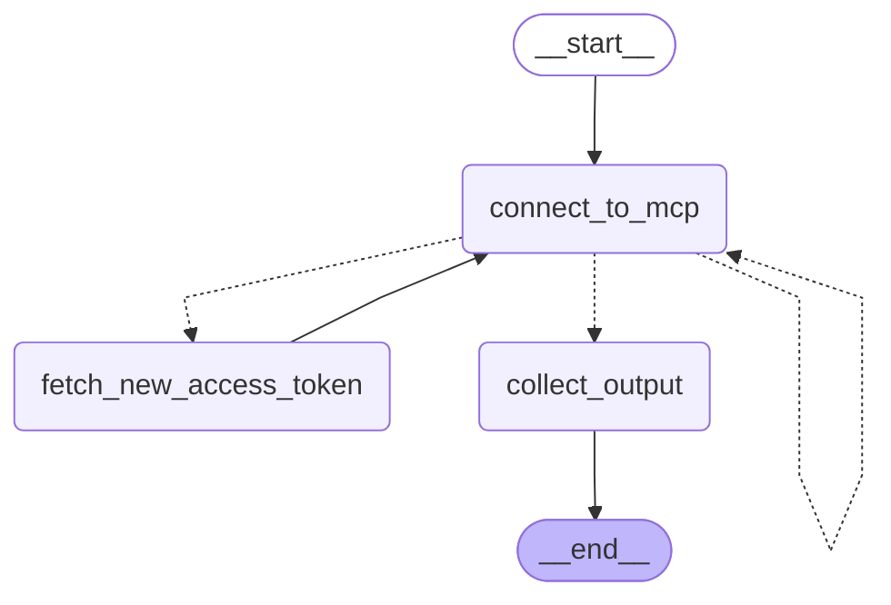

# LangGraph Agent with Claude, OAuth and Tool MCP Servers

This project demonstrates how to build a LangGraph agent powered by Claude 3.5 Sonnet that connects to a remote UiPath MCP server, using an external UiPath application to handle OAuth authentication.

## Overview

The agent uses:
- Claude 3.5 Sonnet as the language model
- LangGraph for orchestration
- Remote tool execution via UiPath MCP server.
- Dynamic access token refresh through client credentials grant (OAuth).

## Architecture



The workflow follows a ReAct pattern:
1. Query is sent to the agent (Claude)
2. The agent first attempts to connect to the remote MCP server using the current `UIPATH_ACCESS_TOKEN`.
3. If the token is missing or expired, the workflow triggers a call to the UiPath external application endpoint to fetch a fresh token and stores it in the environment.
4. Once connected, the MCP tools are loaded into a Claude-powered ReAct agent.
5. The agent receives both system context and the human task, deciding whether to invoke tools or provide a direct answer.
6. The process repeats until the agent has enough information to produce a final response.
7. The response is collected and returned as the workflow output.

## Prerequisites

- Python 3.10+
- `langchain-anthropic`
- `langchain-mcp-adapters`
- `langgraph`
- `httpx`
- `python-dotenv`
- Anthropic API key set as an environment variable
- UiPath OAuth credentials and MCP server URL in environment (`UIPATH_CLIENT_ID`, `UIPATH_CLIENT_SECRET`, `UIPATH_TOKEN_URL`, `UIPATH_MCP_SERVER_URL`, `SCOPE`)

## Installation

```bash
uv venv -p 3.11 .venv
.venv\Scripts\activate
uv sync
```

Set your API keys and MCP Remote Server URL as environment variables in .env

```bash
ANTHROPIC_API_KEY=your_anthropic_api_key
UIPATH_MCP_SERVER_URL=https://alpha.uipath.com/account/tenant/mcp_/mcp/server_slug/sse
UIPATH_TOKEN_URL=***
UIPATH_CLIENT_ID=***
UIPATH_CLIENT_SECRET=***
SCOPE=***

```

## Debugging

For debugging issues:

1. Check logs for any connection or runtime errors:
   ```bash
   uipath run agent --debug '{"task": "What is 2 + 2?"}'
   ```


