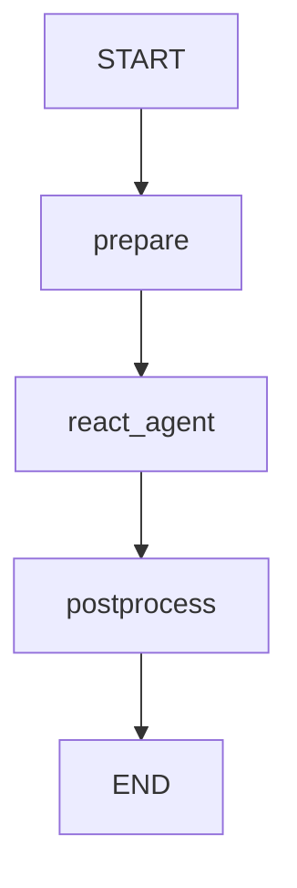

# UiPath LangGraph Template Agent

A quickstart UiPath LangGraph agent. It answers user queries using live tools and supports multiple LLM providers.

> **Docs:** [uipath-langchain quick start](https://uipath.github.io/uipath-python/langchain/quick_start/) — **Samples:** [uipath-langchain-python/samples](https://github.com/UiPath/uipath-langchain-python/tree/main/samples)

## What it does

1. **Prepares** the conversation — injects a system prompt and the user query into state
2. **Runs a ReAct agent node** that autonomously decides which tools to call and in what order
3. **Postprocesses** — validates and truncates the response if it exceeds the configured max length

### Tools

| Tool               | Description                                      |
| ------------------ | ------------------------------------------------ |
| `get_current_time` | Returns the current UTC date and time (ISO 8601) |
| `web_search`       | Searches the web via DuckDuckGo                  |

### LLM Providers

The template defaults to **Bedrock (Claude Haiku 4.5)**. To switch providers, edit `main.py`:

```python
# Choose your LLM provider by uncommenting one of the following:
llm = UiPathChatBedrock(model_name=BedrockModels.anthropic_claude_haiku_4_5)
# llm = UiPathChatOpenAI(model_name=OpenAIModels.gpt_4_1_mini_2025_04_14)
# llm = UiPathChatVertex(model_name=GeminiModels.gemini_2_5_flash)
```

## Graph



## Input / Output

```json
// Input
{
  "query": "What is the current UTC time?"
}

// Output
{
  "response": "..."
}
```

## Running locally

```bash
# Run
uv run uipath run agent --file input.json

# Debug with dynamic node breakpoints
uv run uipath debug agent --file input.json
```

## Evaluation

The agent ships with a tool call order evaluator that verifies the ReAct node calls `get_current_time` **before** `web_search` when given a time-dependent query.

```bash
uv run uipath eval
```
