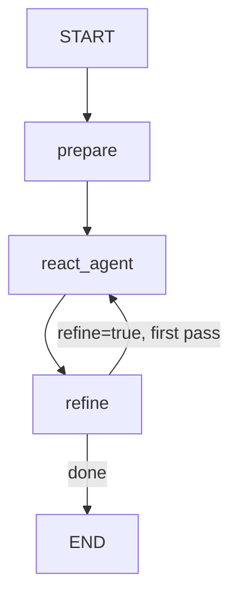

# UiPath LangGraph Template Agent

A quickstart UiPath LangGraph agent. It answers user queries using live tools and optionally runs a second LLM pass to refine its own response.

> **Docs:** [uipath-langchain quick start](https://uipath.github.io/uipath-python/langchain/quick_start/) — **Samples:** [uipath-langchain-python/samples](https://github.com/UiPath/uipath-langchain-python/tree/main/samples)

## What it does

1. **Prepares** the conversation — injects a system prompt and the user query into state
2. **Runs a ReAct agent node** (OpenAI `gpt-4.1-mini`) that autonomously decides which tools to call and in what order
3. **Refines the response** — if `refine=true`, a second LLM (Gemini `gemini-2.5-flash`) acts as a quality reviewer, suggests one concrete improvement, and routes back to the ReAct node for a final pass

### Tools

| Tool               | Description                                      |
| ------------------ | ------------------------------------------------ |
| `get_current_time` | Returns the current UTC date and time (ISO 8601) |
| `web_search`       | Searches the web via DuckDuckGo                  |

## Graph



## Input / Output

```json
// Input
{
  "query": "What is the current UTC time and what are the latest news headlines about agentic AI today?",
  "refine": true
}

// Output
{
  "result": "..."
}
```

Set `refine: false` (default) to skip the refinement pass.

## Running locally

```bash
# Run
uv run uipath run agent --file input.json

# Debug with dynamic node breakpoints
uv run uipath debug agent --file input.json
```

## Evaluation

The agent ships with a tool call order evaluator that verifies the ReAct node calls `get_current_time` **before** `web_search` when given a time-dependent query.

```bash
uv run uipath eval
```

## Actionable improvements

### Add UiPath-native tools

- **Read from an Orchestrator Asset** — use `sdk.assets.retrieve_async(name, folder_path="MyFolder")` to inject dynamic configuration (API keys, base URLs, feature flags) without redeploying
- **Invoke a process** — use `sdk.processes.invoke_async(name, input_arguments, folder_path="MyFolder")` to trigger downstream RPA workflows from the agent's decision

### Add Human-in-the-Loop

Use the durable interrupt pattern with `CreateTask` to pause the graph mid-execution until a human completes the action in UiPath Action Center:

```python
from langgraph.types import interrupt
from uipath.platform.common import CreateTask

task_output = interrupt(CreateTask(
    app_name="AppName",
    app_folder_path="MyFolderPath",
    title="Escalate Issue",
    data={"key": "value"},
    assignee="user@example.com",
))
```

The graph suspends at the `interrupt` call and resumes automatically with `task_output` once the assignee completes the task.

### Ground answers in your own documents

Use Deep RAG to search a Context Grounding index with semantic + generative retrieval instead of the public web:

```python
from langgraph.types import interrupt
from uipath.platform.common import CreateDeepRag

result = interrupt(CreateDeepRag(
    index_name="my-index",
    prompt="What is the refund policy for enterprise customers?",
    index_folder_path="MyFolderPath",
))
```

The graph suspends, runs the Deep RAG task on UiPath, and resumes with the grounded answer.

### Add guardrails

Wrap the graph with input/output guardrails from `uipath_langchain.guardrails` to filter harmful prompts and validate responses before they reach the user.

### Swap the web search tool

Replace `DuckDuckGoSearchRun` with a UiPath Integration Service connection (e.g. Bing, Google Search API) via `sdk.connections.invoke_activity_async(...)` for more reliable, rate-limit-controlled search.

### Add memory

Persist conversation history across runs by storing messages in an Orchestrator bucket or Data Service entity, then loading them in the `prepare` node.
