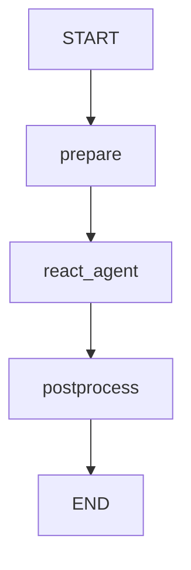

# UiPath LangGraph Template Agent

A quickstart UiPath LangGraph agent. It answers user queries using live tools and supports multiple LLM providers.

> **Docs:** [uipath-langchain quick start](https://uipath.github.io/uipath-python/langchain/quick_start/) — **Samples:** [uipath-langchain-python/samples](https://github.com/UiPath/uipath-langchain-python/tree/main/samples)

## What it does

1. **Prepares** the conversation — injects a system prompt and the user query into state
2. **Runs a ReAct agent node** that autonomously decides which tools to call and in what order
3. **Postprocesses** — validates and truncates the response if it exceeds the configured max length

### Tools

| Tool               | Description                                      |
| ------------------ | ------------------------------------------------ |
| `get_current_time` | Returns the current UTC date and time (ISO 8601) |
| `get_weather`      | Returns weather data for a city (mock data)      |

### LLM Providers

The template defaults to **GPT-4.1 Mini** via `UiPathChat`. To switch providers, edit `main.py`:

```python
# Choose your LLM provider by uncommenting one of the following:
llm = UiPathChat(model="gpt-4.1-mini-2025-04-14")
# llm = UiPathAzureChatOpenAI(model="gpt-4.1-mini-2025-04-14")
# llm = UiPathChatAnthropicBedrock(model="anthropic.claude-haiku-4-5-20251001-v1:0")
# llm = UiPathChatGoogleGenerativeAI(model="gemini-2.5-flash")
```

## Graph



## Input / Output

```json
// Input
{
  "query": "What's the weather like in London?"
}

// Output
{
  "response": "..."
}
```

## Running locally

```bash
# Run
uv run uipath run agent --file input.json

# Debug with dynamic node breakpoints
uv run uipath debug agent --file input.json
```

## Evaluation

The agent ships with a tool call order evaluator that verifies the ReAct node calls `get_current_time` **before** `get_weather` when given a time-and-weather query, and an LLM judge that checks weather output for semantic similarity.

```bash
uv run uipath eval
```
